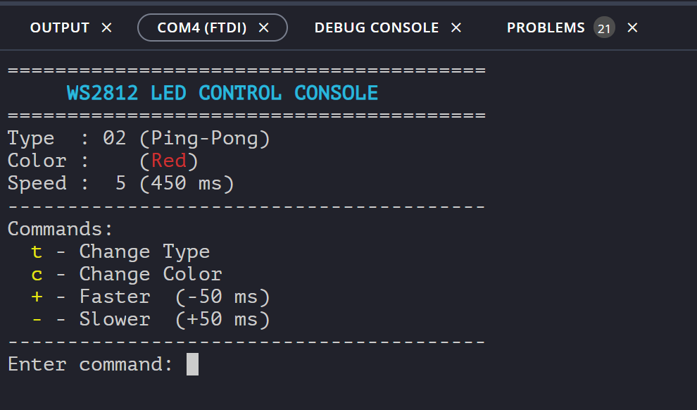

# UART_button_ws2812

Điều khiển module NeoPixel 8 RGB Led WS2812 bằng Button và UART qua Console (Vitis App)

Đề bài: [Assignment MIO-EIO](Assigment_MIO-EIO.pdf) - Thầy Hải - FPT Jetking

## 0. Demo
 
[Video Demo - Youtube](https://youtu.be/NjMW7L0Sqqs)

Chuẩn bị Lab (ZuBoard 1CG - 4 Buttons - Module WS2812)


Console:


## 1. RTL Design
Code verilog gồm 3 module: 
- [**ws2812_driver.v**](verilog/ws2812_driver.v): tạo tín hiệu xuất ra chân led của NeoPixel 8 RGB Led WS2812.
- [**pattern_controller**](verilog/pattern_controller.v): nhận các tín hiệu **type** (kiểu chớp đèn), **color** (màu đèn), **speed** (tốc độ chớp) từ Processor, và xuất hiện tín hiệu điều khiển đến **ws2812_driver.v**.
- [**top_led_controller.v**](verilog/top_led_controller.v): module top kết nối 2 module con phía trên.

Xem code [ở đây](verilog/)

## 2. Block Design on Vivado


- Mở Vivado (tôi dùng Vivado và Vitis version 2024.2.1).
- Tạo project mới, chọn board **ZuBoard 1CG**.
- Add or create design sources -> add 3 file verilog đã chuẩn bị ở phần 1.
- Vào IP Integrator -> Create Block Design.
  
- Add IP **Zynq UltraScale+ MPSoC**.
- Run Block Automation -> Apply Board Preset.
- Double click vào IP **Zynq UltraScale+ MPSoC**:
  + phần PS-PL Configuration -> PS-PL Interface -> Master Interface -> disable AXI HPM1 FPD, chỉ enable AXI HPM0 FPD.
  + phần I/O Configuration -> Low Speed -> I/O Peripherals -> đảm bảo UART 0 được enable (thông thường UART 0 được enable mặc định).
    
- Add IP **AXI GPIO** thứ 1, đổi tên thành **axi_gpio_ctrl**, dùng để giao tiếp giữa Processor phía PS và module **top_led_controller** phía PL.
- Double click vào IP **axi_gpio_ctrl** -> tab IP Configuration, set ***All Output*** và ***GPIO Width*** là 8 (2 bit type, 3 bit color, 3 bit speed).
  
- Add 3 IP **Slice** để chia 8 bit của **axi_gpio_ctrl** ra thành 3 tín hiệu riêng biệt ***type***, ***color***, ***speed***.
  + Double click IP **Slice** thứ 1, set **Din Width** = 8, **Din From** = 1, **Din Down To** = 0, **Din Width** = 2 (cho tín hiệu **type**).
  + Double click IP **Slice** thứ 2, set **Din Width** = 8, **Din From** = 4, **Din Down To** = 2, **Din Width** = 3 (cho tín hiệu **color**).
  + Double click IP **Slice** thứ 3, set **Din Width** = 8, **Din From** = 7, **Din Down To** = 5, **Din Width** = 3 (cho tín hiệu **speed**).
 
- Add module **top_led_controller**, kết nối đầu ra của 3 IP **Slice** lần lượt với 3 tín hiệu **type**, **color**, **speed** của module **top_led_controller**.

- Add IP **AXI GPIO** thứ 2, đổi tên thành **axi_gpio_btn**.
- Double click vào IP **axi_gpio_btn** -> tab IP Configuration, set ***All Input*** và ***GPIO Width*** là 4 (4 button).

- Make External để tạo port cho tín hiệu ***led_data*** (thuộc **top_led_controller**) và tín hiệu ***btn_in*** (thuộc **axi_gpio_btn**).

- Run Connection Automation để Vivado tạo AXI Interconnect và Processor System Reset.
- Kết nối tín hiệu ***reset_n*** của **top_led_controller** với ***peripheral_aresetn*** của **Processor System Reset**.
- Regenerate Layout để sắp xếp lại Design -> Validate Design bảo đảm không có lỗi.
- Right click vào design -> Create HDL Wrapper.. Sau đó, right click Wrapper -> Set as Top.
- Thêm [file constraint](pins.xdc) có nội dung:
  
```
  # Buttons
set_property PACKAGE_PIN F7 [get_ports {btn_in[0]}]
set_property PACKAGE_PIN F8 [get_ports {btn_in[1]}]
set_property PACKAGE_PIN D6 [get_ports {btn_in[2]}]
set_property PACKAGE_PIN D7 [get_ports {btn_in[3]}]
set_property IOSTANDARD LVCMOS33 [get_ports {btn_in[*]}]
set_property PULLUP true [get_ports {btn_in[*]}]

# WS2812 data output
set_property PACKAGE_PIN E5 [get_ports {led_data}]
set_property IOSTANDARD LVCMOS33 [get_ports {led_data}]
```

- Generate Bitstream.
- File -> Export -> Export Hardware -> Include Bitstream -> tạo file platform .xsa cho Vitis.

## 3. Vitis
- Từ phần mềm Vivado -> Tools -> Launch Vitiss IDE.
- Set Workspace.
- Create Platform Component -> chọn file .xsa vừa tạo. Để mặc định cấu hình:
  + OS: standalone
  + Processor: psu_cortexa53_0
  + Arch: 64-bit
- Build Platform.
- Create Empty Embedded Application, chọn platform vừa tạo.
- Add src file gồm 4 file: [main.c](vitis_app/main.c), [led_control.h](vitis_app/led_control.h), [led_menu.c](vitis_app/led_menu.c), [gpio_control.c](vitis_app/gpio_control.c).
- Build Application.
- Cắm ZuBoard, kết nối ZuBoard với PC bằng dây MicoUSB. Nhấn button ON/OFF trên ZuBoard để khởi động Board, đảm bảo Board đang ở boot mode JTAG (check 4 Switch đều ON).
- Tab Vitis -> Serial Monitor -> chọn cổng COM -> set baud rate 11500 để mở cửa sổ Terminal Console.
- Run Application nạp code vào ZuBoard
- Xem thành quả.
